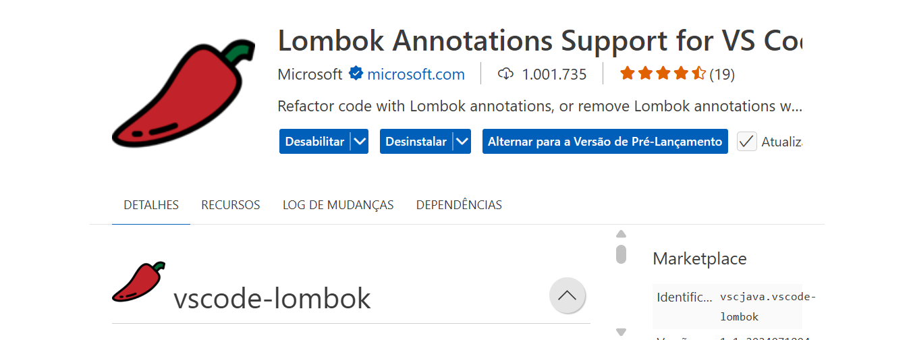

# java-teste-lombok

# Visual Studio Code no Codespaces do GitHub
Instalar a extensão `Lombok Annotations Support for VS Code` para garantir que as `anotações` do `Lombok` sejam reconhecidas.



# Executar os comandos:
```
sdk list java
sdk install java 21.0.6-amzn
sdk default java 21.0.6-amzn
```

```
mvn clean install
```

```
java -jar target/lombok-project-1.0-SNAPSHOT.jar
```

```
git add .
git commit -m "Projeto com Lombok"
git push
```

## OBS: 
# Copiar o conteúdo de um repositório para outro:

* Passo 1 -> Clonar com ``--mirror`` o repositório antigo:
```
git clone --mirror https://github.com/<usuário no GitHub>/<nome do repositório>
```
<br/>

* Passo 2 -> Entrar na pasta clonada:
```
cd <nome da pasta do diretório clonado>
```
<br/>

* Passo 3 -> Criar o novo repositório no GitHub:
```
https://github.com/new
```
**OBS**: não marcar as opções de ``README``, ``.gitignore`` ou ``licença``.
<br/><br/>

* Passo 4 -> Fazer o push com ``--mirror`` para o novo repositório:
```
git push --mirror https://github.com/<usuário no GitHub>/<nome do novo repositório>
```
<br/>

**Exemplo**:
* Passo 1 -> Clonar com ``--mirror`` o repositório antigo:
```
git clone --mirror https://github.com/wdiasmaciel/01-java-teste-lombok.git
```

* Passo 2 -> Entrar na pasta clonada:
```
cd 01-java-teste-lombok.git
```

* Passo 3 -> Criar o novo repositório no GitHub:
```
https://github.com/new
```
**OBS**: não marcar as opções de ``README``, ``.gitignore`` ou ``licença``.

* Passo 4 -> Fazer o push com ``--mirror`` para o novo repositório:
```
git push --mirror https://github.com/wdiasmaciel/02-java-teste-lombok.git
```
